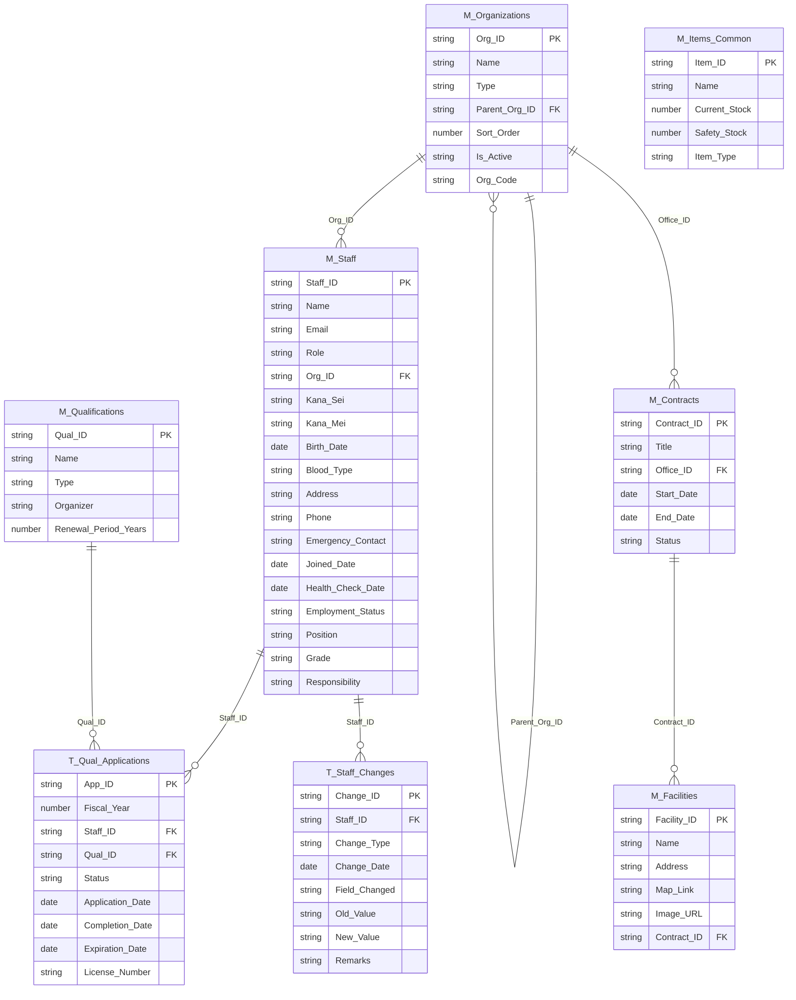
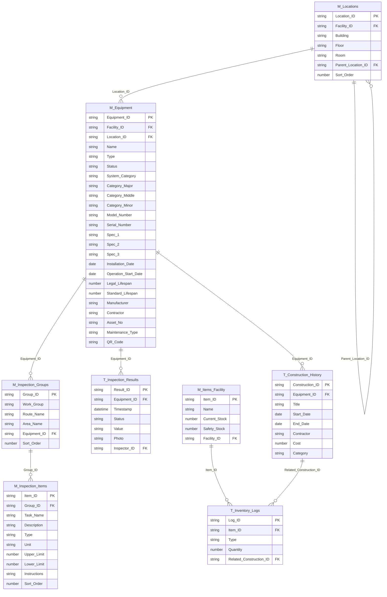

# ハブ＆スポーク型アーキテクチャ移行計画書 (Phase 1)

**作成日**: 2026-02-16  
**プロジェクト**: 水インフラ管理システム - データベース分割移行  
**目的**: 単一スプレッドシート構成から、Master_DB（本部マスタ）+ Facility_DB_[施設名]（施設別DB）への移行

---

## 1. プロジェクト概要

### 1.1 現状（As-Is）
- **構成**: 単一スプレッドシート（`水インフラ管理システム.gsheet`）
- **テーブル数**: 13テーブル（マスタ8 + トランザクション5）
- **データ規模**: 設備情報CSV 1.4MB、点検情報CSV 849KB
- **課題**:
  - データ量増加によるパフォーマンス低下
  - 施設ごとのアクセス権限分離が不可能
  - 点検ルートの柔軟性不足（階層構造が未実装）

### 1.2 目標（To-Be）
- **Master_DB（本部マスタ）**: 全施設共通データを一元管理
- **Facility_DB_[施設名]**: 施設固有データを分離管理
- **新機能**: `M_Locations`（場所マスタ）による階層構造の強化

---

## 2. ER図 / テーブル配置図

### 2.1 Master_DB（本部マスタ）に配置するテーブル



**配置理由**:
- **組織・契約・職員・資格**: 全施設共通の人事・組織情報
- **施設マスタ**: 施設一覧は本部で一元管理
- **共通物品マスタ**: 全施設で共有する標準物品（薬品等）

---

### 2.2 Facility_DB_[施設名] に配置するテーブル



**配置理由**:
- **場所・設備・点検・工事**: 施設固有の資産管理データ
- **在庫**: 施設ごとに独立管理（現場の薬品・部品等）
- **セキュリティ**: 施設ごとにスプレッドシートを分離し、アクセス権限を個別設定可能

---

## 3. 新ID体系の定義

### 3.1 施設プレフィックスの導入

**目的**: 複数のFacility_DBにまたがってもIDが重複しないようにする

| テーブル | 現行ID形式 | 新ID形式 | 例 |
|---------|-----------|---------|-----|
| M_Equipment | `E-001` | `{FacilityCode}_E-00001` | `F001_E-00001` |
| M_Locations | (新規) | `{FacilityCode}_L-00001` | `F001_L-00001` |
| M_Inspection_Groups | `GRP-0001` | `{FacilityCode}_GRP-00001` | `F001_GRP-00001` |
| M_Inspection_Items | `ITM-00001` | `{FacilityCode}_ITM-00001` | `F001_ITM-00001` |
| T_Inspection_Results | `IR-001` | `{FacilityCode}_IR-00001` | `F001_IR-00001` |
| T_Construction_History | `C-001` | `{FacilityCode}_C-00001` | `F001_C-00001` |
| M_Items_Facility | `ITEM-001` | `{FacilityCode}_ITEM-00001` | `F001_ITEM-00001` |
| T_Inventory_Logs | `LOG-001` | `{FacilityCode}_LOG-00001` | `F001_LOG-00001` |

**Facility Code の定義**:
- `M_Facilities.Facility_ID` から派生: `F-001` → `F001`
- 既存の `F-001`, `F-002`, `F-003` を `F001`, `F002`, `F003` に正規化

### 3.2 Master_DB のID体系（変更なし）

| テーブル | ID形式 | 例 |
|---------|-------|-----|
| M_Organizations | `ORG-001` | `ORG-001` |
| M_Contracts | `CON-001` | `CON-001` |
| M_Facilities | `F-001` | `F-001` |
| M_Staff | `S-001` | `S-001` |
| M_Qualifications | `Q-001` | `Q-001` |
| T_Qual_Applications | `A-001` | `A-001` |
| T_Staff_Changes | `CHG-001` | `CHG-001` |
| M_Items_Common | `COMMON-001` | `COMMON-001` |

---

## 4. M_Locations 自動生成ロジック

### 4.1 背景と目的

**現状の課題**:
- `M_Equipment` に `Building`, `Floor`, `Room` が直接格納されている
- 階層構造が表現できず、点検ルートの「行き来」が実現できない
- 場所の一覧表示や検索が困難

**解決策**:
- `M_Locations` テーブルを新設し、場所を独立したエンティティとして管理
- `M_Equipment.Location_ID` で場所を参照する正規化構造に変更

### 4.2 自動生成アルゴリズム

```javascript
/**
 * M_Equipment の Building, Floor, Room から M_Locations を自動生成
 * @param {string} facilityId - 施設ID (例: "F-001")
 * @param {Object[]} equipmentData - M_Equipment の全レコード
 * @returns {Object[]} 生成された M_Locations レコード
 */
function generateLocations(facilityId, equipmentData) {
  const facilityCode = facilityId.replace('F-', 'F'); // "F-001" → "F001"
  const locationMap = new Map(); // 重複排除用
  const locations = [];
  let locationIdCounter = 1;
  
  // Step 1: 施設ルートを作成
  const rootLocationId = `${facilityCode}_L-00000`;
  locations.push({
    Location_ID: rootLocationId,
    Facility_ID: facilityId,
    Building: null,
    Floor: null,
    Room: null,
    Parent_Location_ID: null,
    Sort_Order: 0
  });
  locationMap.set('ROOT', rootLocationId);
  
  // Step 2: 棟 (Building) レベルを生成
  const buildings = [...new Set(equipmentData.map(e => e.Building).filter(Boolean))];
  buildings.forEach((building, idx) => {
    const buildingId = `${facilityCode}_L-${String(locationIdCounter).padStart(5, '0')}`;
    locations.push({
      Location_ID: buildingId,
      Facility_ID: facilityId,
      Building: building,
      Floor: null,
      Room: null,
      Parent_Location_ID: rootLocationId,
      Sort_Order: (idx + 1) * 10
    });
    locationMap.set(`B:${building}`, buildingId);
    locationIdCounter++;
  });
  
  // Step 3: 階 (Floor) レベルを生成
  const floors = [...new Set(
    equipmentData
      .filter(e => e.Building && e.Floor)
      .map(e => `${e.Building}|${e.Floor}`)
  )];
  floors.forEach((floorKey, idx) => {
    const [building, floor] = floorKey.split('|');
    const parentId = locationMap.get(`B:${building}`);
    const floorId = `${facilityCode}_L-${String(locationIdCounter).padStart(5, '0')}`;
    locations.push({
      Location_ID: floorId,
      Facility_ID: facilityId,
      Building: building,
      Floor: floor,
      Room: null,
      Parent_Location_ID: parentId,
      Sort_Order: (idx + 1) * 10
    });
    locationMap.set(`F:${building}|${floor}`, floorId);
    locationIdCounter++;
  });
  
  // Step 4: 部屋 (Room) レベルを生成
  const rooms = [...new Set(
    equipmentData
      .filter(e => e.Building && e.Floor && e.Room)
      .map(e => `${e.Building}|${e.Floor}|${e.Room}`)
  )];
  rooms.forEach((roomKey, idx) => {
    const [building, floor, room] = roomKey.split('|');
    const parentId = locationMap.get(`F:${building}|${floor}`);
    const roomId = `${facilityCode}_L-${String(locationIdCounter).padStart(5, '0')}`;
    locations.push({
      Location_ID: roomId,
      Facility_ID: facilityId,
      Building: building,
      Floor: floor,
      Room: room,
      Parent_Location_ID: parentId,
      Sort_Order: (idx + 1) * 10
    });
    locationMap.set(`R:${building}|${floor}|${room}`, roomId);
    locationIdCounter++;
  });
  
  return { locations, locationMap };
}
```

### 4.3 M_Equipment への Location_ID 紐付けロジック

```javascript
/**
 * M_Equipment に Location_ID を設定
 * @param {Object[]} equipmentData - M_Equipment の全レコード
 * @param {Map} locationMap - generateLocations() で生成したマップ
 * @returns {Object[]} Location_ID が追加された M_Equipment レコード
 */
function assignLocationIds(equipmentData, locationMap) {
  return equipmentData.map(equipment => {
    let locationId = null;
    
    // 優先順位: Room > Floor > Building > ROOT
    if (equipment.Room && equipment.Floor && equipment.Building) {
      locationId = locationMap.get(`R:${equipment.Building}|${equipment.Floor}|${equipment.Room}`);
    } else if (equipment.Floor && equipment.Building) {
      locationId = locationMap.get(`F:${equipment.Building}|${equipment.Floor}`);
    } else if (equipment.Building) {
      locationId = locationMap.get(`B:${equipment.Building}`);
    } else {
      locationId = locationMap.get('ROOT');
    }
    
    return {
      ...equipment,
      Location_ID: locationId
    };
  });
}
```

### 4.4 生成例

**入力（M_Equipment の一部）**:
| Equipment_ID | Building | Floor | Room |
|-------------|----------|-------|------|
| E-001 | 管理棟 | 1F | 中央監視室 |
| E-002 | 管理棟 | 1F | 電気室 |
| E-003 | 処理棟 | 2F | ポンプ室 |

**出力（M_Locations）**:
| Location_ID | Building | Floor | Room | Parent_Location_ID | Sort_Order |
|------------|----------|-------|------|-------------------|-----------|
| F001_L-00000 | null | null | null | null | 0 |
| F001_L-00001 | 管理棟 | null | null | F001_L-00000 | 10 |
| F001_L-00002 | 処理棟 | null | null | F001_L-00000 | 20 |
| F001_L-00003 | 管理棟 | 1F | null | F001_L-00001 | 10 |
| F001_L-00004 | 処理棟 | 2F | null | F001_L-00002 | 10 |
| F001_L-00005 | 管理棟 | 1F | 中央監視室 | F001_L-00003 | 10 |
| F001_L-00006 | 管理棟 | 1F | 電気室 | F001_L-00003 | 20 |
| F001_L-00007 | 処理棟 | 2F | ポンプ室 | F001_L-00004 | 10 |

**M_Equipment への紐付け結果**:
| Equipment_ID | Location_ID |
|-------------|------------|
| E-001 | F001_L-00005 |
| E-002 | F001_L-00006 |
| E-003 | F001_L-00007 |

---

## 5. 移行フェーズの詳細スケジュール

### Phase 1: 移行計画書の作成 ✅（本ドキュメント）
- [x] ER図/テーブル配置図の作成
- [x] 新ID体系の定義
- [x] M_Locations自動生成ロジックの設計
- [ ] **ユーザーレビュー待ち** ← 現在ここ

### Phase 2: 新規DB枠組み作成（Phase 1承認後）
- GASスクリプトで以下を作成:
  1. `Master_DB` スプレッドシート（8テーブル）
  2. `Facility_DB_Template` スプレッドシート（8テーブル）
  3. 各シートのヘッダー行と書式設定
  4. データ検証ルール（プルダウン等）の設定

### Phase 3: データ移行実装（Phase 2承認後）
- 既存データの読み込みとクレンジング
- M_Locations の自動生成と Equipment への紐付け
- ID体系の変換（施設プレフィックスの付与）
- Master_DB と Facility_DB への振り分け書き込み
- 整合性チェック（外部キー制約の検証）

### Phase 4: アプリ接続先変更（Phase 3承認後）
- `Code.gs` の `SPREADSHEET_ID` を Master_DB に変更
- Facility_DB への動的接続ロジックの実装
- `index.html` のUI調整（施設選択機能の追加）
- AppSheet の接続先変更（該当する場合）

---

## 6. リスクと対策

| リスク | 影響度 | 対策 |
|-------|-------|------|
| データ移行時の欠損 | 高 | 移行前に全データのバックアップを取得。移行後に件数チェックを実施 |
| ID変換ミスによる参照エラー | 高 | 移行スクリプト内で外部キー整合性チェックを実装 |
| パフォーマンス低下（複数DB参照） | 中 | キャッシュ機構の強化。必要に応じてデータ同期バッチを実装 |
| ユーザーの混乱 | 中 | 移行前に操作マニュアルを作成。段階的ロールアウト |

---

## 7. 次のアクション

**Phase 1完了条件**: ユーザー様による本計画書の承認

**承認後の作業**:
1. Phase 2の詳細設計（GASスクリプトの実装仕様）
2. テスト用の小規模データセットでの移行リハーサル
3. 本番移行の実施

---

**レビュー依頼**: 本計画書の内容をご確認いただき、修正点や追加要望があればお知らせください。
